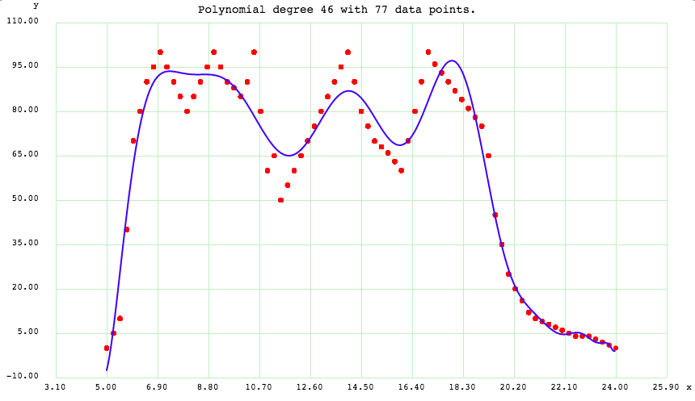
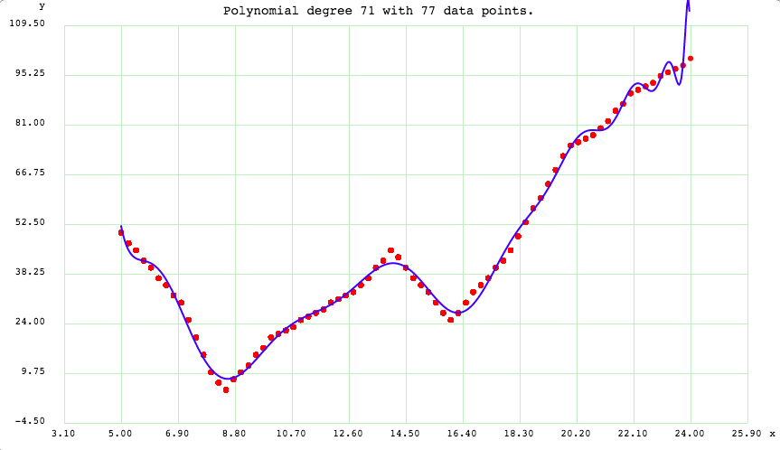
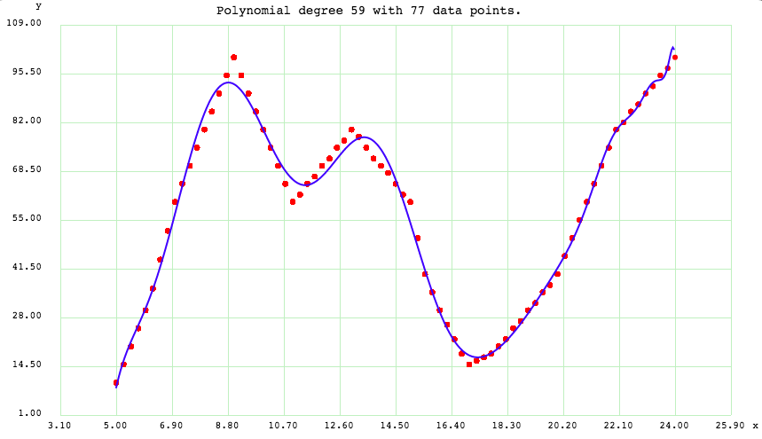

opruut
==============

Its a route optimiser for metro stations and subways which gives 
 a. the shortest travel time, and
 b. maximum comfort [eg: less crowd, possibility of finding a seat, etc..]

Documentation
--------------

**Link :** https://opruut.readthedocs.io/en/latest/

Project Home Page
--------------------

**Link :** https://www.github.com/anirbanroydas/opruut

Details
--------

:Author: Anirban Roy Das
:Email: anirban.nick@gmail.com
:Copyright(C): 2017, Anirban Roy Das <anirban.nick@gmail.com>

Check ``opruut/LICENSE`` file for full Copyright notice.

Overview
---------

Its a route optimiser for metro stations and subways which gives 
 a. the shortest travel time, and
 b. maximum comfort [eg: less crowd, possibility of finding a seat, etc..]

It uses the `Laravel <https://www.laravel.com/>`_  framework to implement the backend along with `react js <https://facebook.github.io/react/>`_ for front end. it is highly scalable and use job queues to handle high load and the huge dataset.

Technical Specs
----------------

:PHP: Primay Server Side Language
:Laravel: Advanced Web Framework for PHP
:JavaScript: Client Side Language
:React: Front end javascript view library
:Redux: Data store for React
:Mysql: Database
:Redis: Session Library, Cache Library, Job Queue
:Neo4j: Graph Database
:Websocket: For live stream
:Socket.io: JavaScript Client for websockets
:NodeJs: For weboskcet(socket.io) server (larvael-echo-server)

Features
---------

* Shortest Route
* Comfort Factor
* Seat finding probility 
* Great UI
* React Js - Redux Js
* Laravel/PHP

Algorithm and Logic
--------------------

We are going to consider (a). **shortest distance or shortest time** to reach destination and (b). **comfort factor** to reach destination. We will determine the optimized route based on these two.

Shortest Distance/Time
~~~~~~~~~~~~~~~~~~~~~~~

To determeine shortest route between source and destination, its pretty straight forward. We just have to find out shortest distance between two vertices in a graph. Here, our station network can be represented in a graph, hence we use **Neo4j** as the graph database to store and query the graph network of the metro stations.

Finding shortest distance is easy. Algorithms like **Shortest Distance** can help us deteremine it. Although its not very scalable but given there will be not huge number of stations in a city, those algorithms will do a good enough job.

But here, we are trying to find the optimized route not only on the basis of distance or time but also on the basis of other factors like comfort, crowd, finding a seat, time of travel.

**Few Things to Note**

* Speed of train is constant
* Means, shortest distance means shortest time too.

Comfort Factor
~~~~~~~~~~~~~~~

This one is not so straight forward. To determine comfort factor and weigh them against shortest distanct/time factor and optimize route using these we have to actually take into consideration how to determine the comfort factor.

So to determine comfort factor, focus is done on 3 factors, one is **crowd factor** for the route, **empty seat factor** throughout the route and **Interchanges** between different metro lines (eg: from blue line to yellow line then yellow line to red line, etc)

To determind **crowd factor** and **empty seat factory**, lets first look at **IF (Importance Factor)** and how it helps in determing the previous two and hence the **Comfort Factor**

Importance Factor (IF)
++++++++++++++++++++++++

So, what is being done here is trying to find **Importance Factor** of each station and which will help us find the comfort factor of a route.

So what and how to find the importance factor of a metro station?

Here are few properties that may determine **Importance Factor (IF)**:

1. Population in the station area
2. Offices in the station area
3. Restaurants (food joints)
4. Entertaiment sources (Movie Theatres, Malls, Game Zones)
5. Educational Institutions
6. Amenities (Hospitals, Parks)

**IF** is directyly propertional to **CF (Comfort Factor)**

Population - Why and How it determines IF?
*******************************************

Let say people entering metro at a particular station is **IN**.
And, people coming out of the metro at a particular station is **OUT**.

Now **IN** and **OUT** are directly propertional to **CF** and thus, **IF**.

Now, people entering and exiting means population entering and exiting. A larger population at a station means more commute in general. Hence **IN** and **OUT** is the population factor.

Now, Population is directly propertional to IF, i.e **IF = c1\*(Population)**, where **c1** is a constant.

Offices
********

Offices determine more people getting out of the metro at that station to go their offices and enter metro after leaving the offices.

Thus, offices directyly propertional to **IF**

**IF = k1\*(Offices)**, where **k1** is a function of time.

**k1 = k1(t)**

This is because people generally come to offices in the morning and leave in the evening. That means more people exiting that metro station in the morning and more people entering the metro station in the evening.

Here is a time graph of **k1** determined after doing a **polynomial regression analysis** on some dataset.

.. image:: screenshots/offices.png 

Restaurants
************

Same reason as Offices. 

**IF = k2\*(Restaurants)**, where **k2** is a function of time.

**k2 = k2(t)**

Here is a time graph of **k2** determined after doing a **polynomial regression analysis** on some dataset.

.. image:: screenshots/restaurants.png 

Entertaiment Sources
**********************

Same reason as Offices. 

**IF = k3\*(Entertaiment_Sources)**, where **k3** is a function of time.

**k3 = k3(t)**

Here is a time graph of **k3** determined after doing a **polynomial regression analysis** on some dataset.

.. image:: screenshots/entertainment.png 

Educational Institutions
*************************

Same reason as Offices. 

**IF = k4\*(Educational_Institutions)**, where **k4** is a function of time.

**k4 = k4(t)**

Here is a time graph of **k4** determined after doing a **polynomial regression analysis** on some dataset.

Amenities (Hospitals)
**********************

Same reason as Population. 

**IF = c2\*(Amenities)**, where **c2** is a constant.

This is because need for ameneties like hospitals does not depend on time. Hence time cannot influece the factor, but more ameneties near a metro station means more commuters enter/exit that station on average. Thus the **IF**.

Crowd Factor
+++++++++++++

Now since we looked into **IF**, lets focus on **crowd factor** and **empty seat factor**.

Crowd factor is directly proportional to **IF**. So we have to determine the **crowd factor** at a specific time by calculating the **IF** at the same time. We already saw how IF is calculated at a specific time usign the graphs and values.

Empty Seat Factor
++++++++++++++++++

Now empty seats meand more probability to sit and hence means more comfort. Empty seat values will keep changing at every station and it also depends on the time of travel and also on the route. The station number in a particular metro line also determines the empty seat factor. 

Lets see a sample empty seat graph for a particular route and how different stations in that metro line may have different empty seats factor depending on time and station number.

So empty seat factory is determined using both time of travel and the above graph.

**Empty Seats = Total Seats(constant) - Crowd in train** [at a particular time].

**Comfort** = Sum of empty seats from source to destination (Since, comfort due to empty seats may change depending on the travel time because shot travel time does not require much comfort requirement, shorter travel time is mroe preferrable but in case of longer travel time, comfort become becomes important factor), i.e. for longer travel time, a large number of (-ve) seat comfort values adds upto a greater negative number which mean more discomfort compared to shorter travel time with lesser (-ve) empty seat vlaue.

**NOTE :**  If seat comfort starts with positive (+ve) value, then it remains constant for the rest of the journey.

Interchanges Factor
++++++++++++++++++++

This is pretty straight forward too. Its the number of interchanges that happen in a route from source to destination. Its is multiplied by an factor to normalize the value to affect the final calculation of **CF** with no bias.

So finally the **Confort Factor (CF)** can be determined by using the above two.

**CF = maximize(empty seat comfort factor) + minimize(crowd factor) + minimize(no. of interchanges of metro line junctions)**

Optimzed Route
~~~~~~~~~~~~~~~

The final calculation of the **Optimzed Route** is done by combining **Travel Time** adn **Confort Factor** and normalizing it using the below formulae.

**Optimized Route = maximize(Confort \* Comfort Preference Factor) + minimize(Travel Time \* Travel Time Preference Factor)**

The Comfort Preference Factor and Travel Time Preference Factor both depends on time and sometimes manually set.

Below are the graphs of the preferences depending on time.

Comfort Preference Plot
++++++++++++++++++++++++

Travel Time Preference Plot
++++++++++++++++++++++++++++

Todo
-----

1. Add Blog post regarding this topic.
2. Add Contract Tests using pact
3. Add integration tests
4. Add e2e tests

