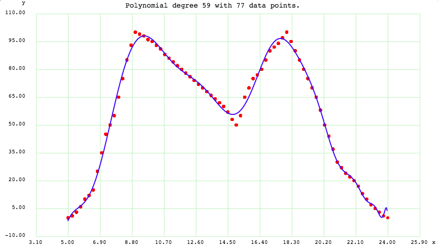
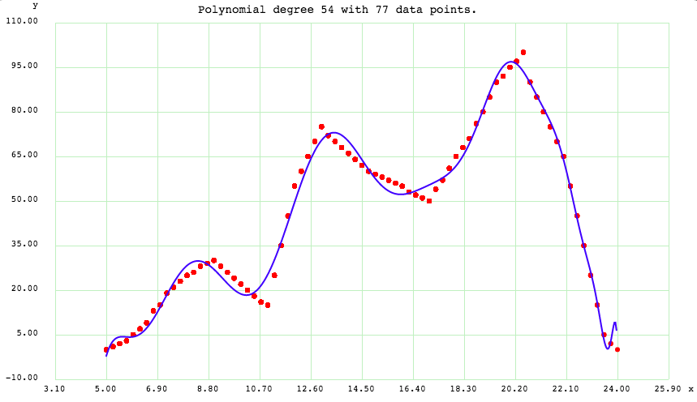
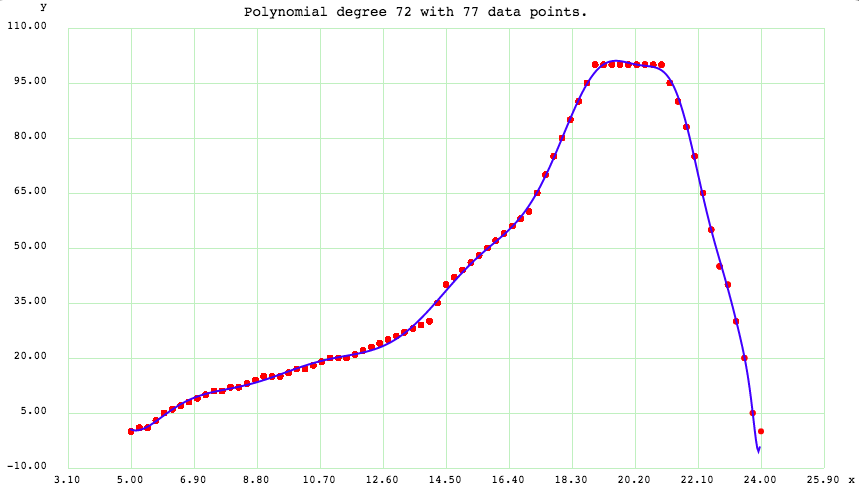

Importance Factor (IF)
=======================

So, what is being done here is trying to find **Importance Factor** of each station and which will help us find the comfort factor of a route.

So what and how to find the importance factor of a metro station?

Here are few properties that may determine **Importance Factor (IF)**:

1. Population in the station area
2. Offices in the station area
3. Restaurants (food joints)
4. Entertaiment sources (Movie Theatres, Malls, Game Zones)
5. Educational Institutions
6. Amenities (Hospitals, Parks)

**IF** is directyly propertional to **CF (Comfort Factor)**

Population - Why and How it determines IF?
-------------------------------------------

Let say people entering metro at a particular station is **IN**.
And, people coming out of the metro at a particular station is **OUT**.

Now **IN** and **OUT** are directly propertional to **CF** and thus, **IF**.

Now, people entering and exiting means population entering and exiting. A larger population at a station means more commute in general. Hence **IN** and **OUT** is the population factor.

Now, Population is directly propertional to IF, i.e **IF = c1\*(Population)**, where **c1** is a constant.

Offices
--------

Offices determine more people getting out of the metro at that station to go their offices and enter metro after leaving the offices.

Thus, offices directyly propertional to **IF**

**IF = k1\*(Offices)**, where **k1** is a function of time.

**k1 = k1(t)**

This is because people generally come to offices in the morning and leave in the evening. That means more people exiting that metro station in the morning and more people entering the metro station in the evening.

Here is a time graph of **k1** determined after doing a **polynomial regression analysis** on some dataset.

Restaurants
------------

Same reason as Offices. 

**IF = k2\*(Restaurants)**, where **k2** is a function of time.

**k2 = k2(t)**

Here is a time graph of **k2** determined after doing a **polynomial regression analysis** on some dataset.

Entertaiment Sources
---------------------

Same reason as Offices. 

**IF = k3\*(Entertaiment_Sources)**, where **k3** is a function of time.

**k3 = k3(t)**

Here is a time graph of **k3** determined after doing a **polynomial regression analysis** on some dataset.

Educational Institutions
-------------------------

Same reason as Offices. 

**IF = k4\*(Educational_Institutions)**, where **k4** is a function of time.

**k4 = k4(t)**

Here is a time graph of **k4** determined after doing a **polynomial regression analysis** on some dataset.

.. image:: ../screenshots/educationInstitutions.png 

Amenities (Hospitals)
---------------------

Same reason as Population. 

**IF = c2\*(Amenities)**, where **c2** is a constant.

This is because need for ameneties like hospitals does not depend on time. Hence time cannot influece the factor, but more ameneties near a metro station means more commuters enter/exit that station on average. Thus the **IF**.

