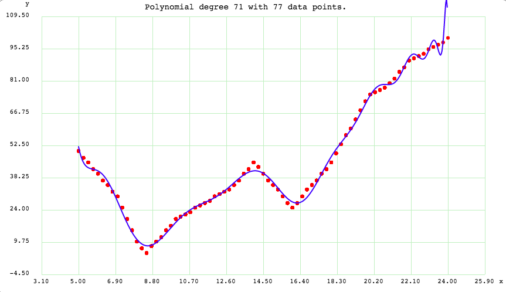
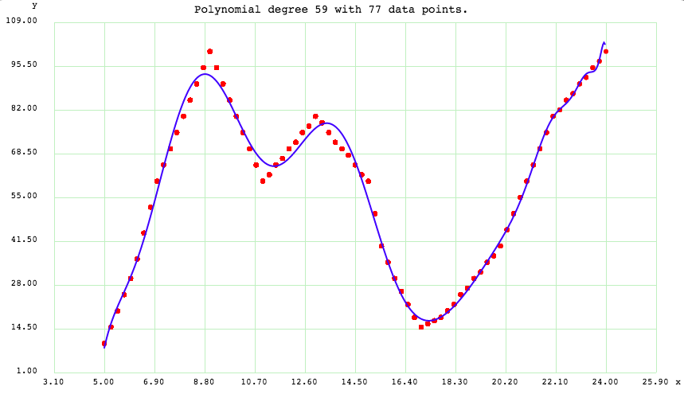

Optimzed Route
===============

The final calculation of the **Optimzed Route** is done by combining **Travel Time** adn **Confort Factor** and normalizing it using the below formulae.

**Optimized Route = maximize(Confort \* Comfort Preference Factor) + minimize(Travel Time \* Travel Time Preference Factor)**

The Comfort Preference Factor and Travel Time Preference Factor both depends on time and sometimes manually set.

Below are the graphs of the preferences depending on time.

Comfort Preference Plot
------------------------

Travel Time Preference Plot
----------------------------

